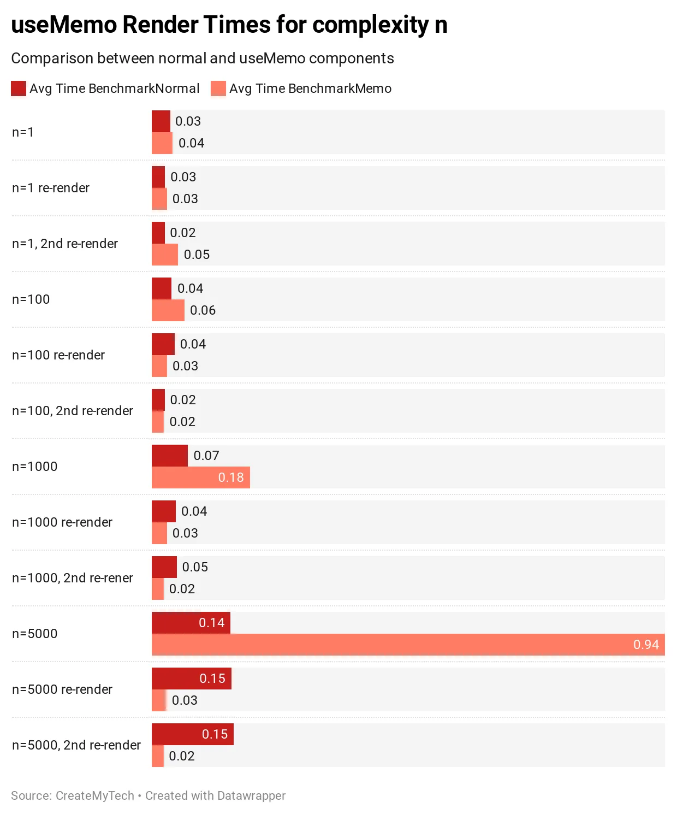

# 여러분들은 리랜더링 최적화는 얼마나 중요하게 여겨야할까?

리랜더링 최적화는 프론트엔드에서 매우 중요한 요소임은 틀림없으며 대규모 애플리케이션을 개발하게 된다면 그 중요성은 더욱 두드러진다. 리랜더링이 비효율적으로 이루어지면 불필요한 성능 저하가 발생할 뿐더러 데이터가 많고 복잡한 트리일 경우 잦은 리랜더링이 랜더링 성능을 크게 저하시킬 수 있다. 애니메이션이 끊기거나 사용자의 상호작용이 느려지며 이는 개발자들에게 가장 직관적인 성능 문제로 다가올 것이다.

React에서는 이러한 문제들을 보다 쉽게 해결하기 위하여 `useMemo` , `useCallback` 과 같은 Hook을 이용해 리랜더링을 제어할 수 있고 `memo` 를 사용해 불필요한 랜더링을 방지할 수 있다. 만약 파일을 다루거나 복잡한 로직이 필요한 경우 Web Worker등을 사용하여 task를 병렬 처리하여 메인 스레드의 부하를 방지하는 것도 좋은 방법일 것이다.

프로그래밍 기술은 양면을 가지고 있다. 리랜더링 최적화를 위해서 포기해야 하는 측면도 있는 것이다. 소개할 게시글은 [useMemo의 필요성을 탐구한 아티클을 번역한 글](https://github.com/yeonjuan/dev-blog/blob/master/JavaScript/should-you-really-use-usememo.md)인데 읽어보자.

[!note]해당 게시글의 번역에서는 복잡성을 메모리제이션하고자 하는 변수의 볼륨으로 생각하면 이해하기 쉽다. 필요하다면 [원문](https://medium.com/swlh/should-you-use-usememo-in-react-a-benchmarked-analysis-159faf6609b7)을 읽어보자.

이 게시글의 벤치마크 결과는 단순히 `string[]` 을 다루었기 때문에, `useMemo` 가 다루는 배열안의 요소가 복잡한 object의 형태를 띄고 있다면 그 결과가 더 두드러진다. 다시 useMemo의 필요성으로 돌아가서 이 아티클은 아래 사진 한장으로 요약될 수 있다.

위 이미지를 살펴보면, 볼륨이 적은(통상적으로 100미만) 경우는 `useMemo` 가 초기랜더링과 리랜더링 모두 더 큰 성능 손실을 보이고 있다. 복잡도가 1000인 경우는 어떨까. 초기 랜더링은 183%의 성능 손실을 보이고 이후 리랜더링에서는 37%가 빠르다. 복잡도가 5000인 경우는 초기 랜더링 속도가 545% 느려지고 후속 랜더링 성능은 609%까지 성장한다. 컴포넌트가 얼마나 많은 리랜더링 과정을 거치느냐에 따라 선택할 수 있는 옵션이 달라지겠지만 아래 두가지를 다시 한 번 생각해보자.

1. 당신의 웹사이트에서 사용하고 있는 리랜더링 성능 향상 목적의 useMemo는 몇개의 인자를 다루고 있는가?
2. 유저가 일반적인 여정으로 당신의 웹사이트를 항해할 때, 몇번의 리랜더링이 발생할 것으로 예상되는가?

글쌔. 대부분의 볼륨, 대부분의 케이스에선 useMemo를 사용하지 않는 것이 더 효율적이지 않겠는가. 이제 눈치를 챘겠지만 내가 말하고자 하는 바는 “리랜더링 충분히 중요하지만 더 중요한건 초기랜더링이지 않을까?” 이다.

[2004년, 인간의 평균적인 주의 집중력 지속 시간은 2분 30초, 현재에 이르러서는 평균 47초로 측정](https://product.kyobobook.co.kr/detail/S000211899532)되었다고 한다. ~~시청자가 TV화면을 보다가 같은 장면이 지속된다면 몇초 이내에 TV채널을 바꿀 것 같은가?~~ 시간이 된다면 다음 [포브스의 기고문](https://www.forbes.com/advisor/business/software/website-statistics/#sources_section)도 읽어보자. 2024년 기준 웹사이트와 관련된 전반적인 통계이다. 내가 이 글에서 인상적으로 읽은 부분은 다음과 같다.

1. 중소기업의 43%가 웹사이트 성능에 투자할 계획이다.
2. 사용자는 0.05초 안에 웹사이트에 대한 첫 인상을 형성한다.
3. 사용자의 47%는 웹사이트가 로드되는 데 2초 이상 기다리지 않는다.
4. 사용자의 40%는 로드되는데 3초 이상 걸리면 사이트를 떠난다.
5. 73%의 사용자가 모바일 웹사이트 로딩 속도가 너무 느린 것을 경험했다고 보고했다.

지금 근무하고 있는 회사의 팀장님이 항상 하시는 말씀이 있는데.. 리랜더링에 목을 매고 달려들고 다른 사이트의 랜더링이 얼마나 최적화가 되었는지에 민감한건 항상 프론트엔드 개발자더라. 생각보다 사업주들과 우리 서비스를 이용하는 고객들은 사이트가 얼마나 안정적으로 돌아가고 초기 컨텐츠를 빠르게 보여주는지 (즉, 대체컨텐츠의 형태로도 제공해주는지)에 관심이 많다고.

이제 슬슬 글에 마침표를 찍어보자. 내가 하고 싶은 말은 “리랜더링 최적화가 중요하지 않다.”가 아니다. 분명히 중요하고 사용자에게 만족감 높은 경험을 주기 위해 반드시 필요한 부분이다. 다만 우리가 바라보는 웹사이트의 성능은 lighthouse의 성능 지표겠지만 유저가 바라보는 우리 웹사이트의 성능 지표는 순수한 자기 자신의 판단이며 만족이다. 주객을 전도해선 안된다. 무엇을 위해 최적화가 필요하다고 생각하는지, 그 최적화를 위해 무엇을 내려놓아야 하는지, **그리고 그것이 본인이 판단해도 되는 것인지** 다시 한번 생각해보자.
